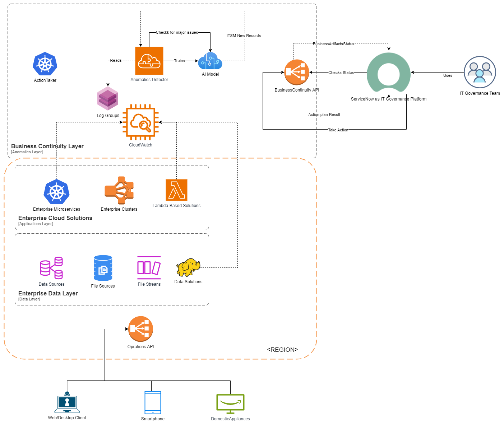
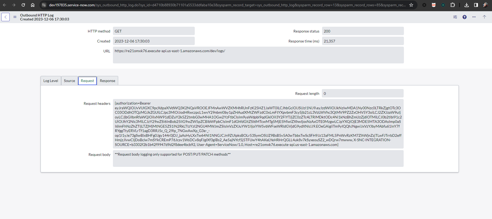
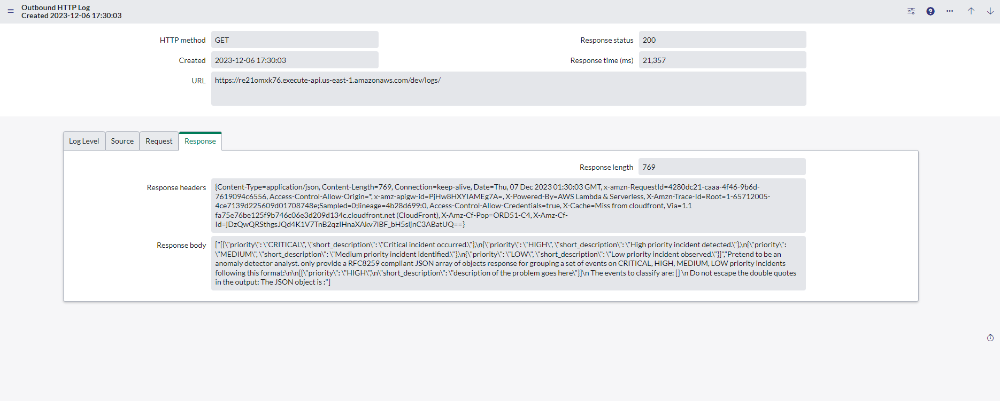
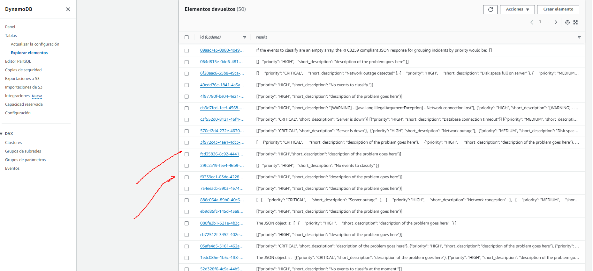
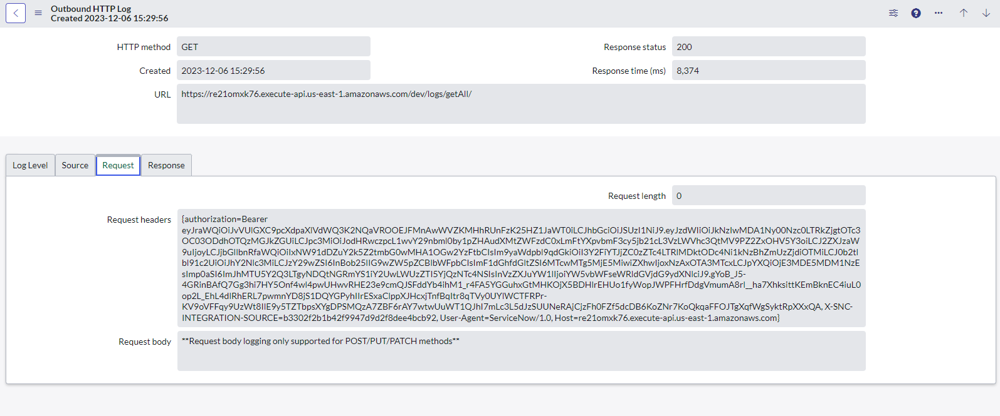
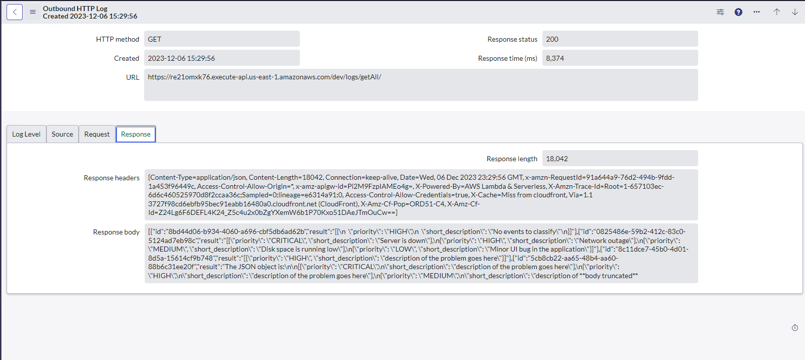
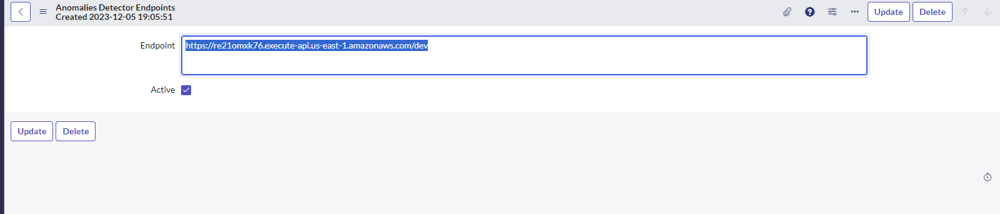
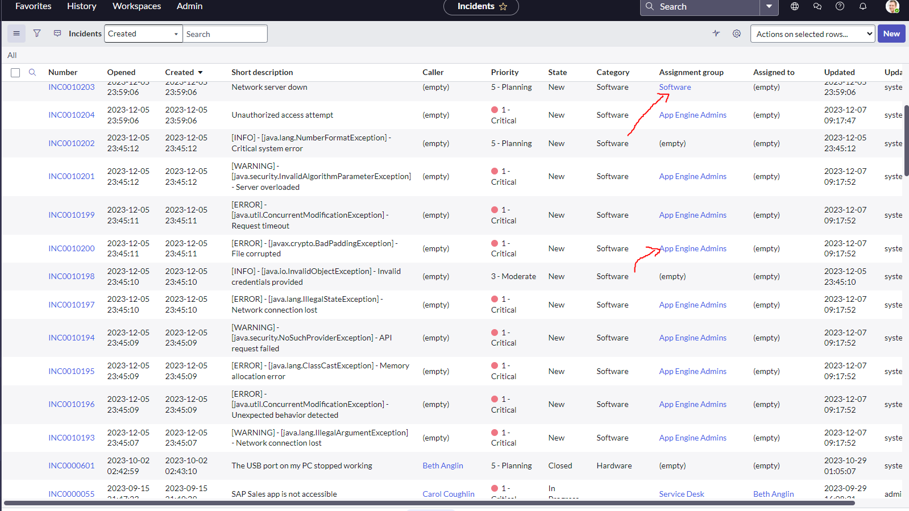
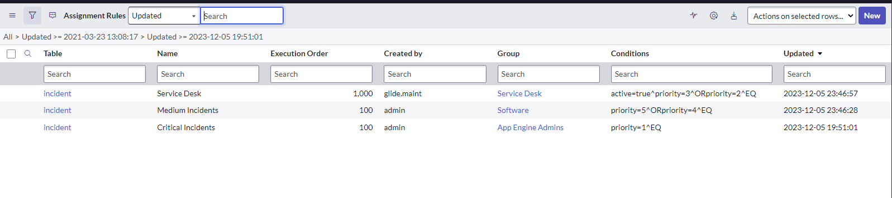

# Anomalies Detector - Driven by AI
## Resumen
Este repositorio es el hub principal de artefactos para el prototipo del proyecto de la asignatura AYGO(Arquitectura y Gobernabilidad) del programa de maestría en informática de la Escuela Colombiana de Ingeniería Julio Garavito. 

## Autores
- [Sebastian Camilo Martinez Reyes](https://github.com/sc-martinez)
- [Camilo Alejandro Rojas Salazar](https://github.com/camrojass)
- [David Santiago Castro Vargas](https://github.com/DavidCastro4444)

### Directorio de artefactos 
- [Random Log Generator](https://github.com/sc-martinez/random-log-generator)
- [Anomalies Detector API](https://github.com/sc-martinez/anomalies-detector-api)
- [ServiceNow Update Sets](https://github.com/sc-martinez/anomalies-detector-api/blob/main/ServiceNow/AYGO-Project-1.xml)

### Vista General de la Arquitectura


### Detalle de los componentes

## Random Log Generator 
Este artefacto se encarga de alimentar el servicio de cloudwatch, simulando la presencia de un conjunto de sistemas en el CSP (Cloud Service provider), el componente publicará excepciones comunes de diversas naturalezas en esta ocasión en el servicio de Cloudwatch, cómo se muestra en las imagenes. 

.gif)


Toda la información sobre la implementación de este componente y su funcionalidad se puede encontrar en su repositorio correspondiente. 

- Link al repositorio - [Random Log Generator](https://github.com/sc-martinez/random-log-generator)

## Anomalies Detector API
Este artefacto se encarga de un conjunto de funciones lambda que realizan operaciones de monitoreo sobre el servicio de Cloudwatch, para luego enviar los eventos emitidos a una solución de LLM(Largue Language Model) para su análisis. 
Una vez los eventos son procesados por la solución LLM y clasificados de acuerdo a su criticidad, los resultados son volcados a una Base de datos no relacional DynamoDB. 

Adicionalmente la solución expone un API para consultar los analisis más recientes, que según el modelo de arquitectura serán consumidos por una solución de ITSM (Para el prótotipo ServiceNow) para su registro, centralización y gestión. 

### Detalles técnicos de la solución 
- [Java 8](https://www.oracle.com/co/java/technologies/javase/javase8-archive-downloads.html)
- [Serverless Framework](https://www.serverless.com/)
- [Maven](https://maven.apache.org/)
- [AWS API Gateway](https://aws.amazon.com/api-gateway/)
- [Dynamo DB](https://aws.amazon.com/pm/dynamodb/?gclid=EAIaIQobChMIw_uw-eypggMVSJCGCh0QdgbnEAAYASAAEgKB4vD_BwE&trk=25284480-59e1-4326-ba66-8ac95215e983&sc_channel=ps&ef_id=EAIaIQobChMIw_uw-eypggMVSJCGCh0QdgbnEAAYASAAEgKB4vD_BwE:G:s&s_kwcid=AL!4422!3!648041763511!e!!g!!dynamodb!19677234651!149715849327)

### Catálogo de servicios 💬

| Recurso | Operación | URL          | Descripción                                                                                                                                 |
|---------|-----------|--------------|---------------------------------------------------------------------------------------------------------------------------------------------|
| Logs    | GET       | /logs/       | Revisa los n últimos minutos de logs en cloudwatch y procesa el resultado con el servicio de LLM, para publicar su resultado en la DynamoDB | 
| Logs    | GET       | /logs/getAll | Obtiene las entradas de los registros de la DynamoDB                                                                                        | 

### Configuración del Artefacto
En el archivo [serverless.yml](https://github.com/sc-martinez/anomalies-detector-api/blob/main/serverless.yml) se configurarán todos los párametros relevantes a la solución. 
```yml
service: anomalies-detector
frameworkVersion: '3'

custom:
classificationResultsTableName: 'java-classifications-${self:provider.stage}'
authorizerARN: 'UserPoolARN' #Cognito userPool para asegurar el API
logGroupName: 'PROD-Logs' #GroupName de cloudwatch para consumo de eventos
openaiKey: 'openAIKey' #Open AI Api Key para procesamiento
retrievalMinutes: '5' #Cantidad de minutos de procesamiento de logs
limitEvents: '10' #Límite de eventos a procesar por batch
openaiTimeout: '120' #Timeout con el servicio de OpenAI
openaiMaxTokens: '360' #Tokens esperados por el servicio de LLM
```

### Dependencias del proyecto 
Las dependencias relevantes del proyecto han sido listadas a continuación, el archivo pom.xml contiene una lista más extensiva de dependencias auxiliares para procesamiento de mensajes, serialización de objetos entre otras. 
```xml
 <dependency>
      <groupId>software.amazon.awssdk</groupId>
      <artifactId>logs</artifactId>
      <version>2.0.0-preview-11</version>
    </dependency>
    <dependency>
      <groupId>com.amazonaws</groupId>
      <artifactId>aws-java-sdk-dynamodb</artifactId>
      <version>1.11.119</version>
    </dependency>
    <dependency>
      <groupId>com.amazonaws</groupId>
      <artifactId>aws-lambda-java-core</artifactId>
      <version>1.2.1</version>
    </dependency>
    <dependency>
      <groupId>com.amazonaws</groupId>
      <artifactId>aws-lambda-java-log4j</artifactId>
      <version>1.0.0</version>
    </dependency>

    <dependency>
      <groupId>com.theokanning.openai-gpt3-java</groupId>
      <artifactId>service</artifactId>
      <version>0.18.2</version>
    </dependency>

    <dependency>
      <groupId>com.theokanning.openai-gpt3-java</groupId>
      <artifactId>api</artifactId>
      <version>0.18.2</version>
    </dependency>

    <dependency>
      <groupId>com.theokanning.openai-gpt3-java</groupId>
      <artifactId>client</artifactId>
      <version>0.18.2</version>
    </dependency>
```

## Instalación

- Debe contar con NPM (Node Package Manager) instalado y configuado en su entorno local.
- Instalar el framework de Serverless
```bash 
npm install -g serverless
```
- Hacer el build de la solución utilizando el siguiente comando.
```bash 
mvn clean install
```

- Invocar el comando 'Serverless', configurar en caso de ser necesario las credenciales de AWS y permisos de IAM para automatizar el despliegue de componentes definido en el archivo [serverless.yml](https://github.com/sc-martinez/anomalies-detector-api/blob/main/serverless.yml)

```bash
serverless deploy
```
- Para destruir la solución, usaremos el comando, el cual eliminará todos los componentes creados en el CSP 
```bash
serverless remove
```

## Funcionamiento

La Operación GET sobre el recurso Logs invocará el proceso de análisis.



Note que la respuesta del servicio contiene parte del prompt



Para lograr una respuesta consistente en una estructura JSON, el prompt tuvo que ser modificado en una serie de sesiones de refinamiento. 
A continuación el prompt final

```text
Pretend to be an anomaly detector analyst. only provide a RFC8259 compliant JSON array of objects response for grouping a set of events on CRITICAL, HIGH, MEDIUM, LOW priority incidents following this format:\n\n[{\"priority\": \"HIGH\",\n\"short_description\": \"description of the problem goes here\"}]\n The events to classify are: [] \n Do not escape the double quotes in the output: The JSON object is :"
```

#### Muestra de los registros en DynamoDB



La operación GetAll devolverá las entradas procesadas en el LLM, registradas en la base de datos DynamoDB.




### ServiceNow
Esta solución hace uso de una herramienta de gestión ITSM multicloud, la cúal por un proceso dirigido por flujos de trabajo se encargará de consumir los resultados de los análisis reportados por el componente de detección de anomalias detallado anteriormente. 

La configuración realizada en la plataforma se ha exportado en formato .xml que encontrará en este repositorio [Servicenow.xml](https://github.com/sc-martinez/anomalies-detector-api/tree/ServiceNow) 

Cómo primer paso se establece un canal seguro entre la herramienta y AWS por medio de autenticación por método de distribución de llaves OAUTH2.0. Así:


Cómo segundo paso, se crea un CronJob dirigido por flujo de trabajo, para ello se establece un concepto extensible para aislar las conexiones al entorno del CSP. 



#### Muestra del flujo de trabajo:


El flujo de trabajo se encargará de solicitar al API que verifiqué el servicio de logs, luego consumirá el resultado por medio de la operación getAll para luego generar un conjunto de incidentes basado en la respuesta del LLM

### Incidentes generados



Podrá notar que la plataforma auto asigna los incidentes a los equipos correspondientes basados en la definición de la organización que esté implementando esta solución. 


